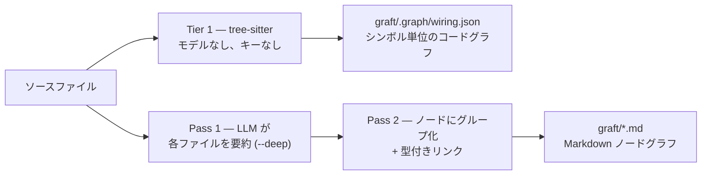

<div align="center">


### Claude Code、Cursor、Codex、Gemini、そしてあらゆるコーディングエージェントを強化：より高速・低コストで、あなたのコードベース固有の文脈理解を実現。

<p>
  <a href="https://github.com/NanoNets/Graft"></a>
  <a href="https://graft.nanonets.ai"></a>
  <a href="https://discord.gg/zxmKweAA29"></a>
  <a href="https://www.npmjs.com/package/@nanonets/graft"></a>
  <a href="https://www.npmjs.com/package/@nanonets/graft"></a>
  <a href="https://nodejs.org"></a>
  
  
  
  <a href="https://scorecard.dev/viewer/?uri=github.com/NanoNets/Graft"></a>
</p>

### 最大 **4倍低コスト**、**3倍高速**、しかも正確性は向上または低下なし。

| 指標 | 通常の Claude Code | graft を使用した Claude Code |
|---|---|---|
| ツール呼び出し削減 | ベースライン | **+46%** |
| トークン節約 | ベースライン | **+42%** |
| 時間短縮 | ベースライン | **+60%** |
| 正確性 | 54% | **66%（+12ポイント）** |

<sub>効率性は162回の管理されたベンチマーク（同じエージェント、同じファイルツール、違うのはコンテキストのみ）。正確性は **SWE-bench Verified** で、公式ハーネスにより採点 — graft はテストしたインスタンスの66%を解決し、通常の Claude Code は54%でした。[効率性の手法 ↓](#benchmark) · [SWE-bench ↓](#swe-bench-verified) · [リポジトリ別の数値 ↓](#tested-on-your-popular-repos)</sub>

</div>

<p align="center">
  
</p>

---

## 目次

- [クイックスタート](#quick-start)
- [問題](#the-problem)
- [Graft がすること](#what-graft-does)
- [ベンチマーク](#benchmark)
- [SWE-bench Verified](#swe-bench-verified)
- [グラフの構築方法](#how-the-graph-gets-built)
- [対応言語](#supported-languages)
- [ノードの中身](#whats-in-a-node)
- [どこで何が動くか](#what-runs-where)
- [エージェント統合](#agent-integration) — [MCP サーバー](#mcp-server) · [Claude Code（深い統合）](#claude-code-deep-integration)
- [CLI](#cli)
- [検索と全体把握](#search--orient-graft-grep--graft-map) (`graft grep` / `graft map`)
- [モノレポと複数リポジトリフォルダ](#monorepos--multi-repo-folders)
- [可視化](#visualize-it-graft-viz) (`graft viz`)
- [人気リポジトリでのテスト](#tested-on-your-popular-repos)
- [開発](#development)
- [ライセンス](#license)

---

<a id="quick-start"></a>
## クイックスタート

```bash
npm install -g @nanonets/graft   # CLIを一度だけインストール
graft init                       # グラフを構築 + Claude Code に組み込む
```

セットアップはこれだけです。`graft init` は、どのコーディングエージェントに組み込むかを尋ね、あなたのコードから `graft/` を構築し、`.claude/` にステータスラインとフックを配置します。そのため次のセッションから Graft が Claude Code とともに動作します。各プロンプトに一致するノードを取り込み、各ターン終了後にバックグラウンドでグラフを再構築します。デーモンは不要で、再インデックスを覚えておく必要もなく、デフォルトでは実行・保守するものもありません — グラフはただのファイルです。

あなたが選択するまで何も書き込まれません。最初に変更対象のすべてのファイルを確認するには `graft init --dry-run`、プロンプトをスキップして Claude Code のみに組み込むには `graft init --agents claude` を実行します。

`graft build` は自動的に `graft/` を `.gitignore` に追加します — グラフはローカルで再生成可能なキャッシュ（`node_modules` のようなもの）であり、コミットするものではありません。共有するのは `init` が `.claude/` に配置した組み込み設定です。各チームメンバーは自分のグラフを生成するために `graft build` を実行します：

```bash
git add .claude && git commit -m "wire in graft"
```

グローバルインストールを避けたい場合は、`npx @nanonets/graft init` でも同じように動作します。

<p align="center">
  
</p>

---

<a id="the-problem"></a>
## 問題

すべてのタスクで、あなたのコーディングエージェントは何も知らない状態から始まります。何かを変更する前に、リポジトリを再探索します：用語を grep し、ファイルを開き、import をたどり、戻って、もう一度試します。1時間前にマッピングして捨てたコードベースの全体像を、また作り直しているのです。この再発見が、実行時のツール呼び出し、トークン、レイテンシの大半を消費し、しかもそれは純粋なオーバーヘッドです：

- **繰り返される。** すべてのタスクで探索コストをゼロから再度支払います。
- **捨てられる。** エージェントが理解したことは、セッションとともに消えます。
- **共有されない。** 次のチームメンバーも、そのエージェントも、またゼロから始めます。

人間はコードベースに一度オンボーディングします。エージェントは毎回オンボーディングします。

<p align="center">
  
</p>

---

<a id="what-graft-does"></a>
## Graft がすること

Graft はその理解を**一度**構築し、システム、API、概念ごとに1ノードという形で、リンクされたMarkdownファイル群としてあなたのリポジトリに書き込みます。

- **シンボル一覧ではなく、本物の説明。** 各ノードは、システムの一部が何をし、他の部分とどうつながるのかを、シニアエンジニアが説明するように平易な英語で説明します。エージェントが探索を省略するために実際に必要なのはこの部分です。関数名の羅列ではありません。
- **読める本物のグラフ。** 埋め込みも、類似度検索も、常時稼働させるインデックスもありません。グラフはリンクされたファイル群で、エージェントはリポジトリ内の他のファイルとまったく同じように開き、grepし、たどります。
- **git に接ぎ木される。** グラフは `graft/` 内のただのファイルです。コミットすれば、リポジトリを clone した誰もがそれを持てます。データベースも、サーバーも、セットアップも不要です。同期は Git が担い、古くなったグラフは外部ストアで腐るのではなく、レビュー時の diff として表示されます。
- **diff はコードと一緒に存在する。** 変更によって構造が動けば、それを引き起こしたコードのすぐ隣で、同じプルリクエスト内のグラフ diff として確認できます。
- **あなたのプロバイダー、あなたのキー、あなたのモデル。** 要約は、OpenAI、Anthropic（ネイティブ）、OpenRouter、Fireworks、Groq、LiteLLM プロキシ、ローカルモデルなど、あなたが選んだ任意のプロバイダーに、自分のキーで書かせられます。構造的コードグラフ（`graft build`、`graft check`）は決定論的な tree-sitter によるもので、モデルを一切呼び出しません。

<p align="center">
  <picture>
    <source media="(prefers-color-scheme: dark)" srcset="assets/graft-cold-vs-graft-dark.png">
    
  </picture>
</p>

---

<a id="benchmark"></a>
## ベンチマーク

グラフを読むエージェントは、間違った回答を増やすことなく、より安く・速くなるはずです。それが主張のすべてなので、断言するのではなく測定しました。

ハーネスでは、同じファイルツールを持つ同一の Claude Sonnet 5 エージェントについて3つのバリエーションを実行しました：**cold**（ゼロから探索）、**Graft**（`graft ask --source` のバンドルを最初に投入）、**pull**（graft_find_code/graft_file_api ツール、何も注入しない — 必要になったときだけコンテキストのコストを支払う）。Opus 4.8 のジャッジが必須キーワードの最低条件付きで正確性を採点したため、速いが間違っている回答が速さだけで勝つことはできません。コストはキャッシュを考慮しています：読み取り ≈0.1倍、書き込み 1.25倍で、エージェントが実際に動作する課金モデルです。

162回の実行、2つのリポジトリ（graft 自体と実在する Node/Express 認証サービス）、各3試行、タスクは単一ファイル質問と複数ファイル質問に分割。

| 指標（タスクあたり平均） | 通常の Claude Code | graft を使用した Claude Code |
|---|---|---|
| コスト節約（$） | 0.0429 | **0.0292（+32%）** |
| トークン節約 | 8,070 | **4,650（+42%）** |
| ツール呼び出し節約 | 4.2 | **2.3（+46%）** |
| レイテンシ短縮（秒） | 39.8 | **15.8（+60%）** |
| 正確性 | 93% | 93%（同等） |

どのコーパスでも、Graft の回答が cold より悪くなることはありませんでした。pull バリエーションはその速度の大半を手放す代わりに、もっと大きな成果を得ました：正確性が98%へ上昇し、cold より+5ポイントで、今回の一連のテストで最も強い単一結果でした。速度が必要なら push、正しさがより重要なら pull です。

---

<a id="swe-bench-verified"></a>
## SWE-bench Verified

上の一連のテストは、私たちのハーネスで私たちの仕組みを測定したものです。そこで業界標準も実行しました — **SWE-bench Verified**、実在するリポジトリの実在する GitHub issue を使い、公式 `swebench` ハーネスで採点します。ジャッジモデルも、類似度スコアもありません：あなたのパッチが適用され、メンテナー自身のテストが実行され、通っているテストを壊さずに失敗中のテストを通せるか、できないかです。

**50インスタンス**、両方で同じモデル — **Claude Sonnet 5** — 同じ Docker イメージ、同じターン上限。唯一の違いは graft が組み込まれているかどうかです。

| 正確性と効率性 | 通常の Claude Code | graft を使用した Claude Code | 改善 |
|---|---|---|---|
| 正確性 | 27 / 50（54%） | **33 / 50（66%）** | **+12ポイント** |
| トークン節約 | 142.0M | **109.4M** | **+23%** |
| コスト節約 | $52.34 | **$42.43** | **+19%** |
| ツール呼び出し節約 | 1,370 | **1,031** | **+25%** |
| APIリクエスト節約 | 2,455 | **1,875** | **+24%** |
| 実時間短縮 | 13,094s | **8,922s** | **+32%** |

graft は、通常の Claude Code の27件に対して、**50件中33件のインスタンスを解決**しました — しかもツール呼び出しは25%少なく、トークンは23%少なく、実時間は32%短縮。正確性で勝ったケースはすべて同じ形です：ベースラインは1ファイルを修正し、その兄弟ファイルを見落とします。`django-11532` では、修正に必要な5ファイルのうち1つだけを修正し、以前通っていたテストを18件壊しました。それも2回とも。`django-16263` では4ファイル中1つだけを修正し、102 / 103 でした。graft は残りを見つけました — そして `django-16263` では半分のトークン、半分の時間で実現しました。

2つのハーネス、2つの主張：管理されたテストでは graft がより安く、より速いことを示し、SWE-bench ではさらに正確であることも示しました。

<sub>正確性は全インスタンスを対象。トークン、コスト、呼び出しは、同条件比較のため両方の方式が解決できたインスタンスを対象。公式 SWE-bench Verified イメージと公式 `swebench` 4.1.0 grader、ネイティブ x86_64。</sub>

---

<a id="how-the-graph-gets-built"></a>
## グラフの構築方法

Graft は2つのパスでグラフを構築し、どちらも言語モデルによって処理されます：

1. **各ファイルを読む。** すべてのソースファイルを一度だけ要約し、何をするものかの短い説明を作ります。
2. **ノードにまとめる。** それらの要約を、サブシステム、主要ファイル、概念からなる厳選されたノード群にまとめ、それらの間に型付きリンクを張ります。Graft はファイルごとに1ノードにするのではなく、適切な詳細度を選んでくれるため、大きなリポジトリでも数十個の読みやすいノードになります。



すべてのパスはコンテンツハッシュでキャッシュされます — LLM を使うものも、tree-sitter のパースも同様です。再実行時は変更されたファイルだけを処理するため、2回目のビルドは高速かつ安価です（このリポジトリ、124ファイル：コールド0.74秒、1ファイル編集後0.18秒、何も変更なし0.18秒）。`graft build --no-reuse` はコールドな再パースを強制します。

この低コストさによって、**すべてのクエリが回答前にグラフを更新**できます。取得呼び出しはツリーの状態を前回ビルド時のフィンガープリントと比較し（約3ms）、何かが動いている場合のみ再構築します — そのため `ask`/`grep`/`callers`/`skeleton`/`map` は、git に保存されていない編集も含め、今この瞬間のコードを説明します：未コミット、未ステージ、ステージ済みは、git を一切読まない graft にとってすべて同じです。更新は構造的で `$0`、LLM は決して呼び出しません。コマンド単位で無効化するには `--no-refresh`、全体で無効化するには `GRAFT_NO_REFRESH=1` を使います。

Markdown グラフと並行して、`graft build` は `graft/.graph/wiring.json` — シンボル単位のコードグラフ — に加えて、ソースツリーを反映したファイル単位の wiring card も構築します。Tier 1 は純粋な tree-sitter（すべての関数、クラス、呼び出しエッジ。決定論的で、モデルなし、ネットワークなし）なので、通常の `graft build` にキーは不要です。`--deep` パスでは、シンボルごとの1行要約と crux 抜粋を追加し、body hash でキャッシュします。

---

<a id="supported-languages"></a>
## 対応言語

Graft は tree-sitter を用いて2段階の忠実度で解析し、さらに任意で
コンパイラ級レイヤーを追加します — すべて `$0` で決定論的（モデルなし、キーなし）：

- **完全忠実度** — スコープを認識し、ファイル横断の呼び出し・import 解決を行う手書き extractor：
  **TypeScript / JavaScript**（JSX & TSX を含む）、**Python**、**Go**、**Java**。

- **広範囲** — シンボル（関数、クラス、メソッド、型など）に加え、言語ごとに1つの grammar を持つ汎用 tree-sitter extractor による名前解決済みの呼び出しエッジ：
  **Rust、C、C++、C#、Ruby、PHP、Kotlin、Scala、Swift、Elixir、Solidity、
  OCaml、Zig、Dart**。

- **コンパイラ級エッジ（任意）** — `graft build --lsp` は、言語サーバーが `PATH` 上にある場合、静的パスでは型を特定できない member call に対して正確な `lsp_resolved` 呼び出しエッジを追加します：**rust-analyzer**（Rust）、**clangd**（C/C++）、
  **gopls**（Go）、**pyright**（Python）、**typescript-language-server**（TS/JS）。
  ベストエフォートです — サーバーがインストールされていない場合、グラフは変更されません。

合計20言語。リストにない言語のファイルはインデックスされず、スキップされます。
broad-tier 言語の追加は小さな contribution です — 現在の言語を追加した人たちは
[CREDITS.md](CREDITS.md) を参照してください。

---

<a id="whats-in-a-node"></a>
## ノードの中身

ノードは1つの Markdown ファイルです。多くのコードマップは住所で止まります：これはそのファイルのその行にある、と。それではエージェントに見る場所は教えられても、何が見つかるかは分からないため、結局ソースを開いて読む必要があります。Graft のノードは意味をインラインに持つため、エージェントは必要なことを前もって学び、さらに必要な場合だけファイルを開きます。

各ノードが持つもの：

| 部分 | 内容 |
|---|---|
| **Summary** | コードが何をするかを平易な英語で説明したもの。モデルが作成し、キャッシュされます。コードが一度も文書化されていなくても存在し、ソースが変更されると再生成されます。 |
| **Crux** | 実際にロジックを担う数行：guard、skip condition、state change。ソースからそのまま抜き出してインライン保存するため、エージェントは何をするかだけでなく、*どう*動くかを見られます。 |
| **Sources** | ノードの元になった正確なファイル。各ファイルは content hash で追跡されるため、Graft はノードがいつ古くなったかを正確に判断できます。 |
| **Links** | 他ノードへの型付き接続（`depends_on`、`part_of`、`uses`、`implements`、`produces`）。エージェントがたどれる `[[wikilinks]]` として記述されます。 |
| **Notes** | 生成ブロックの下にあなたが書く任意の内容。再生成後も保持されるため、あなた自身のコンテキストが上書きされることはありません。 |

つまり1ファイルに3段階の深さがあります：summary はコードが*何を*するかを示し、crux は*どう*するかを示し、sources はエージェントがさらに必要とした場合に残りを指します。単純な index では1つのことを知るためにファイル全体を読む必要があります。Graft のノードは答えをインラインで渡し、その後の読み取りが不要になることも多いです。

crux は行範囲ではなくコード自体として保存されます。これは意図的です。関係ないコードが上に追加されるだけで行番号はずれますが、重要な行自体は変わりません。番号ではなくテキストを保持することで、周囲のファイルが動いても crux は正しいままです。

_Summary、sources、links、notes は現在 Markdown ノードとして提供されています。crux はコードグラフ内でシンボル単位に提供されています（`graft build --deep`）。Markdown ノードへのインライン化は次です。_

---

<a id="what-runs-where"></a>
## どこで何が動くか

- **あなたのマシン上、キーなし、ネットワークなし：** 構造的コードグラフ。`graft build`（wiring graph + ファイル単位カード）、`graft check`、`graft ask` は決定論的な tree-sitter です — モデルを一切呼び出しません。
- **あなたのプロバイダーキー経由：** LLM が記述する部分 — `graft build --deep` は概念ノード（ファイル要約 + ノード統合）と、シンボル単位の要約・crux を追加します。graft はベンダー中立です：`GRAFT_PROVIDER`（OpenAI互換エンドポイントなら `openai`、ネイティブAPIなら `anthropic`）、`GRAFT_API_KEY`、`GRAFT_MODEL` を設定し、さらに `openai` wire format の場合は `GRAFT_BASE_URL` を設定して、OpenRouter、Fireworks、Groq、LiteLLM proxy、ローカルサーバー、OpenAI 本体を指定します。またはコマンドラインで `--provider/--model/--api-key/--base-url` を渡します。（`OPENROUTER_API_KEY` は非推奨の fallback として引き続き動作します。）
- **テレメトリなし**、analytics なし — ネットワーク呼び出しは、あなたが設定した LLM リクエストだけです。

設定の完全な一覧（モデル、base URL、graph directory）は [`.env.example`](.env.example) を参照してください。

---
<a id="agent-integration"></a>
## エージェント統合

1つのコマンドで、使用しているコーディングエージェントに Graft を組み込みます：

```bash
npx @nanonets/graft init
# エージェントを検出し、それぞれのネイティブな指示ファイルを書き込む；
# Claude Code にはさらに下記のライブステータスライン + フックが追加される
```

ターミナル上では、`init` が認識しているすべてのエージェントを表示します — 設定ディレクトリから検出したものには印を付け、それぞれが書き込む正確なファイルを一覧表示します — そしてあなたが選択したものだけに組み込みます。Claude Code はあらかじめ選択されています。それ以外は何も選択されていません。選択したエージェントには、共有指示ファイル内にマーカーで囲まれた Graft セクション — `AGENTS.md`（Codex、OpenCode、およびそれを読むその他CLI）、`GEMINI.md`、`.github/copilot-instructions.md` — または専用の rule/skill file を使うエージェントには Graft が完全所有するファイルが追加されます：`.claude/skills/graft/SKILL.md`、`.cursor/rules/graft.mdc`、`.kiro/steering/graft.md`、`.windsurf/rules/graft.md`、[AdaL](https://adal.sylph.ai) 用の `.adal/skills/graft/SKILL.md`。Claude Code は後者のグループです：`init` は専用 skill file を書き込み、あなたの `CLAUDE.md` には一切触れません。再実行時は Graft 自身のセクションだけを更新する（または専用ファイルを置き換える）ため、その他の内容には一切触れません。

プロンプトを表示できる TTY がない場合 — CI、Dockerfile、パイプされた shell — `init` は**何も書き込まず**、代わりに実行すべきコマンドを表示します。スクリプト実行を明示するには `--agents <ids>` または `--yes` を渡します。

| フラグ | 効果 |
|---|---|
| `--agents <ids...>` | 指定したものだけに組み込み、プロンプトなし — ids: `agents`, `cursor`, `gemini`, `copilot`, `kiro`, `windsurf`, `adal`, `claude` |
| `--yes`, `-y` | プロンプトをスキップし、**検出された**すべてのエージェントに組み込む |
| `--dry-run` | `init` が変更するすべてのファイルを表示し、書き込まずに終了 |
| `--all-agents` | 検出されているかどうかに関係なく、認識しているすべてのエージェント向け指示ファイルを書き込む |
| `--no-agents` | Claude Code の組み込みだけを行い、その他のエージェントをスキップ |
| `--list-agents` | 認識している agent id を表示して終了 |
| `--no-mcp` | MCP サーバー登録をスキップ |
| `--no-hooks` | hook のインストールをスキップ |
| `--no-global` | このリポジトリ外への書き込み（下記の `~/.codex/` エントリ）をスキップ |

#### リポジトリ外への書き込み

`agents` host を選択すると、`~/.codex/` が存在する場合、**ユーザーレベル**の Codex 設定にも変更が加えられます：

| パス | 変更内容 |
|---|---|
| `~/.codex/config.toml` | Graft MCP サーバー（`[mcp_servers.graft]`）を登録 |
| `~/.codex/hooks/graft/graft-hooks.cjs` | post-edit hook shim |
| `~/.codex/hooks.json` | `Write\|Edit\|MultiEdit` に一致する `PostToolUse` エントリ |

どちらの設定もユーザーレベルなので、このリポジトリだけでなく、Codex で開く**すべての**リポジトリに適用されます。picker ではこれらを `machine-wide` と表示し、`--dry-run` では専用セクションに一覧表示します。`--no-global` は `AGENTS.md` への組み込みを維持しつつ、これらをスキップします。

<a id="mcp-server"></a>
### MCP サーバー

`graft init` は、対応しているエージェントに Graft の MCP サーバーも登録するため、shell を使わずに以下6つのツールがネイティブに表示されます。Claude Code にも追加されます：`graft init` はプロジェクトの `.mcp.json` にサーバーを書き込みます（読み込むには Claude Code を再起動）。スキップするには `--no-mcp`、手動実行するには `graft mcp [dir]` を使います。

| ツール | 受け取るもの | 用途 |
|---|---|---|
| `graft_find_code` | 質問 | file:line とソースをインライン化したランキング済みノード — 通常はこれだけで完全な回答になり、追加の読み取りは不要。 |
| `graft_file_api` | ファイルパス | そのファイル内のすべての signature、body なし — 10分の1のトークンで API surface を取得。 |
| `graft_trace_calls` | シンボル | 何がそれに依存しているか、または `direction: out` でそれが何に依存しているかを N 階層までたどり、blast radius を確認。 |
| `graft_find_all` | regex | すべての hit を enclosing symbol ごとにグループ化し、その symbol の結合度が高い順にランキング。 |
| `graft_repo_map` | なし | 不慣れなリポジトリを最初に見るためのもの：directory cluster、hub、hotspot。 |
| `graft_check_freshness` | なし | ローカルグラフがコードからずれているかどうか。 |

エージェント側で明示指定が必要な場合は、手動で登録します：

```json
{ "mcpServers": { "graft": { "command": "npx", "args": ["-y", "@nanonets/graft", "mcp"] } } }
```

CLI エージェントがユーザーレベルの `hooks.json` をサポートしている場合、`init` は Graft の post-edit hook もインストールします — 編集後の blast-radius 警告と、`$0` の自動グラフ再同期です（スキップするには `--no-hooks`）。

<a id="claude-code-deep-integration"></a>
### Claude Code（深い統合）

`graft init` は常に Claude Code を組み込み、Claude Code には上記の skill file 以上のものが追加されます。それ以降、このリポジトリで開かれた任意の Claude Code セッションには次が追加されます：

- **ライブステータスライン** — グラフサイズ、enriched の割合、コードがグラフより先に進んだ場合の `⚠ N stale` 警告
- **自動同期** — すべての graft query は、回答前にまずグラフを最新化するため、回答は未コミットの編集も含め、常に今この瞬間のコードを説明します。query は読んだものだけを更新し、`graft/` 配下の Markdown はコードに触れたターンの終了時にバックグラウンド再構築で更新されます。どちらも構造的で `$0` — 自動同期が自発的に LLM を呼び出すことはありません
- **必要なときにコンテキスト** — 各プロンプトが一致するノードをセッションへ取り込みます。ファイルを編集すると、それに依存するもの（"blast radius"）が表示されます。新しいセッションは repo map から始まります

<p align="center">
  
  <br/><sub>install → init → hook がすべてのセッションでグラフを最新に保つ</sub>
</p>

<p align="center">
  
  <br/><sub>ファイルを編集 → blast radius がインライン表示 → グラフが自動再同期 → <code>graft viz</code> で確認</sub>
</p>

`graft init` は冪等で、既存の `.claude/settings.json` を決して上書きしません — 自分のブロックを merge し、それ以外はそのまま残します。LLM 要約も欲しいですか？ キーを用意して、好きなタイミングで `graft build --deep` を実行してください。自動同期がこれを勝手に実行することはありません。

---

<a id="cli"></a>
## CLI

```bash
graft build [dir]                    # [dir] のコードから graft/ を構築：wiring graph + ファイル単位カード（LLMなし、キーなし）
graft build --deep                   # LLMレイヤーを追加：concept node + シンボル単位の summary/crux（キャッシュ）
graft build --extensions .ts .py     # これらのコード拡張子だけを含める
graft build --no-reuse               # 変更なしのものをキャッシュから再利用せず、すべてのファイルを再パース

graft ask "<task>" [dir]             # グラフを問い合わせる — ランク済みノード + 正確な file:line（LLMなし、キーなし）
graft ask "<task>" --json            # 機械可読な結果
graft ask "<task>" --in <scope>      # monorepo/multi-repo folder の1つのサブプロジェクトに絞る（下記参照）

graft skeleton <file> [dir]          # 1ファイル内のすべての signature、bodyなし — 約1/10のトークンで API surface（LLMなし、キーなし）

graft callers <symbol> [dir]         # 誰が symbol を call/reference/import/implement/extend するか（LLMなし、キーなし）
graft callers <symbol> --direction out  # 逆方向：symbol 自身が call/reference するもの（旧 `graft callees`）
graft callers <symbol> -d N          # 深さ N まで推移的にたどる — 完全な blast radius（旧 `graft impact`）

graft grep "<regex>" [dir]           # indexed file 全体を完全 regex 検索し、enclosing symbol ごとにグループ化（LLMなし、キーなし）
graft grep "<regex>" --in <path>     # この path prefix 配下のファイルに絞る
graft grep "<regex>" -i --fixed      # 大文字小文字を区別しない；pattern を regex ではなくリテラル文字列として扱う

graft map [dir]                      # token budget 付き repo orientation — directory cluster、hub、hotspot（LLMなし、キーなし）
graft map --max-dirs N               # 表示する directory 数を増減

graft check [dir]                    # graft/ がコードからずれていれば失敗（exit 1）（自動更新は決してしない — drift report）
graft check --json                   # drift report を JSON で表示

# ask / skeleton / callers / grep / map はすべて、working tree が動いていれば先にグラフを更新する：
#   --no-refresh                     # ディスク上にあるそのままのグラフから回答
#   GRAFT_NO_REFRESH=1               # 同じ設定をすべてのコマンドに適用
#   GRAFT_REFRESH=hash               # size+mtime を信頼せず、すべてのファイルを hash

graft viz [dir]                      # グラフを見る：localhost でインタラクティブ viewer を提供
graft viz --port 5000 --no-open      # port を選択；ブラウザを自動で開かない

graft init [dir]                     # 組み込むエージェントを選ぶ（terminal で prompt；選択するまで何も書き込まない）
graft init --dry-run                 # 変更するすべてのファイルを一覧表示し、終了
graft init --agents cursor kiro      # 指定エージェントだけに組み込み、promptなし（ids: agents, cursor, gemini, copilot, kiro, windsurf, adal, claude）
graft init --yes                     # promptなし；検出されたすべてのエージェントに組み込む
graft init --no-global               # repo 外への書き込み（~/.codex/ config + hooks）をスキップ
graft init --no-build                # ファイルの組み込みだけを行い、グラフを構築しない
graft init --all-agents              # 検出されているかに関係なく、認識しているすべてのエージェントに組み込む
graft init --list-agents             # 認識している agent id を一覧表示して終了

graft version                        # インストール済み + npm で公開されている最新バージョンを表示
graft upgrade                        # npm install -g で公開されている最新バージョンをインストール
                                      # 新しいバージョンは自動的に通知される（1日1回確認）；
                                      # upgrade 後、次の session でこの repo の wiring が自動更新される

# global
graft --dir <path>                   # <repo>/graft 以外の context dir を使用
graft --version, -v                  # インストール済みバージョンを表示して終了
```

method call は receiver の型を通じて解決されます — constructor assignment
（`self.router = APIRouter()`）や型 annotation を使用し、call-site の
名前だけに依存しません — そのため `callers`/`grep --in` は method-heavy なコードで、
その名前を持つすべての method ではなく、正しい型に bind された call を返します。

<a id="search--orient-graft-grep--graft-map"></a>
## 検索と全体把握（`graft grep` / `graft map`）

`graft grep "<regex>"` は、すべての indexed file を完全検索し、hit を
enclosing symbol ごとにグループ化し、`graft map` と同じ in-edge coupling でランキングします —
`graft ask` のランク上位 N 件だけでは不十分な「この pattern が現れるすべての箇所」タスク向けです：

```
"NEEDLE" — 1 files 内の2 symbolsで2 hits（1 indexed files を検索）

heavilyCalled · function · src/a.ts:L1-L3 · 3 in-edges
  L2: console.log("NEEDLE hit in heavilyCalled");

rarelyCalled · function · src/a.ts:L4-L6 · 0 in-edges
  L5: console.log("NEEDLE hit in rarelyCalled");
```

`graft map` は token budget 付きでリポジトリを最初に把握するためのものです — directory cluster と
file/symbol count、各 directory の local hub、global hotspot を表示します —
すべて in-degree でランキングされ、LLM なし、キーなし：

```
repo map — 113 files · 687 symbols · 2186 edges · typescript

src/                63 files · 527 symbols   hubs: contextDirFor (node-file.ts, 21←), wiringPath (write.ts, 14←), buildGraph (build.ts, 11←)
test/               43 files · 102 symbols   hubs: edge (graph-traverse.test.ts, 4←), graphOf (graph-traverse.test.ts, 4←), fileNode (graph-map.test.ts, 3←)
viewer/             5 files · 58 symbols   hubs: $ (main.ts, 9←), activeGraph (main.ts, 5←), cvar (data.ts, 5←)
scripts/            2 files · 0 symbols

hotspots: contextDirFor · function · src/context/node-file.ts:L100-L103 · 21←  wiringPath · function · src/graph/write.ts:L20-L22 · 14←  buildGraph · function · src/graph/build.ts:L104-L218 · 11←  ...
```

<a id="monorepos--multi-repo-folders"></a>
## モノレポと複数リポジトリフォルダ

Graft は設定なしで2つの形に対応します：

- **1つの `.git` を持つモノレポ**（`pnpm-workspace.yaml`/`package.json` の
  `workspaces`、または package ごとの `go.mod`/`pyproject.toml`/`Cargo.toml`） —
  `graft build` は各サブプロジェクトを ranking scope として検出します。`ask`/`map` は
  各 scope をそれぞれの条件でランキングし、結果を融合するため、最大の
  サブプロジェクトが小さなものを埋もれさせることはありません。hit には `[scope/]` ラベルが付き、
  `graft map` は directory cluster を最初に scope ごとにグループ化します。
- **別々の git repo が入ったフォルダ**（最上位に `.git` なし） — `graft build` は
  自動分割します：各 child に独自の（git-ignored の）`graft/` が作られ、parent には
  `graft/workspace.json` index が作られます。parent からの query は
  すべての child を横断して連合し、常に `<child>/` のラベルが付きます。child 内で `graft build` を実行すれば
  その repo だけを扱えます。

どちらの場合も、作業場所が分かったら `graft ask "<task>" --in <scope>/` で
1つのサブプロジェクトに絞れます。

multi-repo folder の parent で `graft init` を実行すると、parent だけでなく**すべての child repo にも組み込みます** —
agent session は repo root で開かれ、そこから instruction file を読むため、
各 child にそれぞれ必要です。parent で開始した session は federated view を取得し、
child で開始した session はその repo だけを見ます。

コマンドは subdirectory からでもグラフを見つけます：`[dir]` 引数がない場合、
最も近い `graft/` まで上方向に探索するため、`src/deep/inside/` からでも
repo root に `cd` することなく `graft ask` が動作します。

<a id="visualize-it-graft-viz"></a>
## 可視化（`graft viz`）

`graft viz` は、両方のグラフをローカルのインタラクティブビューで開きます — install 不要、dev
server 不要。viewer は package 内にビルド済みで同梱されています。

<p align="center">
  
  <br/><sub>検索 → node へ移動 → dependency graph が点灯</sub>
</p>

- **Context** tab — `graft/*.md` からの architecture graph。node は
  type ごとに色分けされ、connectedness に応じた大きさになります。
- **Code** tab — `graft/.graph/wiring.json` のシンボル単位グラフ（先に `graft build` を実行）。
- **Outline** tab — file → class → method の階層を折りたたみ可能な tree として表示。

edge はコードの言葉で語ります。すべての link は閉じた verb set のいずれかで、
それぞれが、コードを構築・レビューする人が実際に尋ねる問いに答えます：

| 動詞 | 答える問い |
|---|---|
| `part_of` / `contains` | これはどこに存在するか？ |
| `uses` / `calls` / `imports` / `depends_on` | これを変更したら何が壊れるか？ |
| `produces` | この出力はどこから来るか？ |
| `configures` | コード変更なしで何がその挙動を変えるか？ |
| `validates` | 何がこれをチェックまたは判定するか？（test、drift check、scoring） |
| `extends` / `implements` | どの contract を守る必要があるか？ |

node を選択すると、その edge に方向が付きます：**amber = その node が依存しているもの、
teal = その node に依存しているもの**。highlight された各 edge には verb が記載されます。
canvas 上部の chip で verb ごとに filter できます。tree-sitter が抽出した edge は実線、
LLM が推論したものは破線で描画されます。viewer はディスク上の `graft/` が
変更されると live reload します。曖昧な verb（`influences`、`supports`）を持つ古い graph は
読み込み時に正規化されます — 再生成は不要です。

---

<a id="tested-on-your-popular-repos"></a>
## 人気リポジトリでのテスト

[ベンチマーク](#benchmark) は仕組みを測定します。本当のテストは、graft がエージェントによる**実際の変更のリリース**を助けるかどうかであり、単に質問へ答えられるかではありません。そこで人気のオープンソース repo でベンチマークしました：各 repo **15タスク**、実際の開発者質問10件に加え、**実際の実装タスク5件**（実際に merge された pull request を、それぞれ base commit から再実装し、maintainer が実際に変更したファイルに対して採点）。同じ agent（Claude Opus）、同じ file tool。唯一の違いは graft が組み込まれているかどうかです。

これらの repo 全体で、graft は**最大4倍低コスト、3倍高速**で、正確性は向上または低下なし：maintainer が変更したのと同じファイルに触れることで、実際に merge された PR を再現します。repo ごとの詳細は以下です。

### PocketBase（Go、約350ファイル）

| 15タスクの集計 | 通常の Claude Code | graft あり |
|---|---|---|
| コスト | $13.91 | **$11.02（−21%）** |
| 実時間 | 2,044s | **1,762s（−14%）** |
| 再現したPR | 5 / 5 | **5 / 5（maintainer と同じファイル）** |

正確性を失うことなく、より安く、より速い：graft は merge 済みPR 5件すべてを再現し、maintainer と同じファイルに触れました。差が最も大きいのはファイル横断の理解です — 「OAuth2 provider 全体で auth はどう動くか」は $2.19 から $0.84 に下がりました。

<details>
<summary><b>私たちが尋ねた10個の質問</b></summary>

1. **全体把握** — PocketBase の architecture map を示してください：主要な subsystem と、HTTP request が database に到達するまでの流れ。
2. **entry-point trace** — client が REST API 経由で record を作成するときに何が起こるかを、route handler から database write まで end-to-end で追跡してください。
3. **feature location** — 完全に新しい collection field type を追加したいです。どこに組み込み、どの部分を変更する必要がありますか？
4. **bug localization** — Realtime subscription がしばらくすると silently に event を配信しなくなります。どこから調べ始めますか？ また、その理由は？
5. **blast radius** — record-validation logic の signature を変更した場合、何がそれに依存し、何が壊れる可能性がありますか？
6. **cross-file synthesis** — OAuth2 provider 全体で auth はどう動きますか：token はどこで発行、検証、保存、refresh されますか？
7. **拡張性** — PocketBase を Go framework として使い、custom route と on-record-create hook を登録するにはどうすればよいですか？
8. **security discovery** — user input はどこで validation され、collection API access rule は query 実行前のどこで enforcement されますか？
9. **public API** — external app として、どう authenticate し、その後 REST API で record を list/filter しますか？
10. **test verification** — record CRUD API の test はどこにあり、access rule について何を assert していますか？

</details>

<details>
<summary><b>再実装した5つの merge 済みPR</b></summary>

各 PR は base commit まで reset され、graft の diff は merge 済みPR が変更したファイルと比較して採点されました。

| PR | 種別 | 内容 | maintainer が触れたファイル |
|---|---|---|---|
| [#6744](https://github.com/pocketbase/pocketbase/pull/6744) | feat | WebP thumbnail を生成・配信 | `apis/file.go`, `tools/filesystem/filesystem.go` |
| [#6947](https://github.com/pocketbase/pocketbase/pull/6947) | fix | regex random string で均一な文字分布 | `tools/security/random_by_regex.go` |
| [#6690](https://github.com/pocketbase/pocketbase/pull/6690) | refactor | Patreon OAuth2 を `x/oauth2/endpoints` 使用へ変更 | `tools/auth/patreon.go` |
| [#2726](https://github.com/pocketbase/pocketbase/pull/2726) | perf | hot middleware path 上の冗長な admin-count query を削除 | `apis/middlewares.go` |
| [#3192](https://github.com/pocketbase/pocketbase/pull/3192) | fix | automigration rollback 時に以前の API rule を復元 | `plugins/migratecmd/templates.go` |

</details>

<details>
<summary><b>手法</b></summary>

同じ commit の PocketBase clone を2つ用意：1つは `graft init` で組み込み、もう1つは untouched かつ graft-free であることを確認。各タスクは empty MCP config で headless（`claude -p`、Claude Opus）実行。理解を問う質問は、回答が正しいファイルと関数を指しているかで採点し、PR task は agent の diff が merge 済みPR と同じファイルに触れたかで採点しました。すべての transcript を監査し、graft 側では実際に graft が使われ、standard 側では存在しないことを確認しました。

</details>

---

<a id="development"></a>
## 開発

```bash
git clone https://github.com/NanoNets/context-graph-engine.git && cd context-graph-engine
npm install
npm run build
npm test

npm run cli -- build --deep .      # source から CLI を実行
```

---

<a id="license"></a>
## ライセンス

MIT。[LICENSE](LICENSE) を参照してください。
