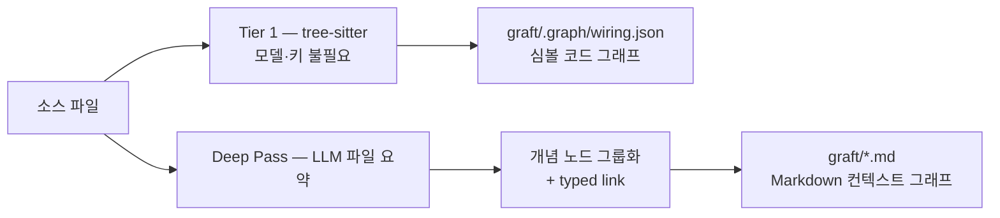

<div align="center">


[English](README.md) · [한국어 학습 가이드](guide/README.md)

### Claude Code, Cursor, Codex, Gemini 등 코딩 에이전트가 코드베이스 전용 맥락을 바탕으로 더 빠르고 저렴하게 작업하도록 돕습니다.

### 정확도를 유지하거나 높이면서 최대 **4배 저렴하고 3배 빠르게**

| 지표 | 콜드 Claude Code | Graft를 사용한 Claude Code |
|---|---|---|
| 도구 호출 감소 | 기준 | **46% 개선** |
| 토큰 절감 | 기준 | **42% 개선** |
| 시간 절감 | 기준 | **60% 개선** |
| 정확도 | 54% | **66%(+12%p)** |

<sub>효율은 같은 에이전트·파일 도구를 사용하고 컨텍스트만 달리한 162회 통제 벤치마크다. 정확도는 공식 harness로 채점한 SWE-bench Verified 결과다. 측정 조건과 저장소별 수치는 아래 절을 참고한다.</sub>

</div>

> 이 문서는 원본 `README.md`의 한국어 번역·재구성본이다. 명령, 수치, 제품명은 원문을 보존했다. 기준 버전은 이 저장소의 `@nanonets/graft` 0.11.0이다.

## 목차

- [빠른 시작](#빠른-시작)
- [문제와 해결 방식](#문제와-해결-방식)
- [벤치마크](#벤치마크)
- [그래프 생성 방식](#그래프-생성-방식)
- [지원 언어](#지원-언어)
- [노드의 구성](#노드의-구성)
- [로컬 실행과 LLM 실행의 경계](#로컬-실행과-llm-실행의-경계)
- [에이전트 통합](#에이전트-통합)
- [CLI](#cli)
- [검색과 저장소 파악](#검색과-저장소-파악)
- [모노레포와 다중 저장소](#모노레포와-다중-저장소)
- [시각화](#시각화)
- [개발](#개발)

## 빠른 시작

```bash
npm install -g @nanonets/graft
graft init
```

`graft init`은 연결할 코딩 에이전트를 묻고, 코드에서 `graft/` 그래프를 만든 뒤 선택한 에이전트의 설정을 작성한다. Claude Code에는 statusline과 hook도 연결한다. 다음 세션부터 관련 노드를 프롬프트에 넣고 각 turn 뒤 백그라운드에서 구조 그래프를 갱신한다. daemon이나 별도 데이터베이스가 없고 그래프는 파일로 존재한다.

실제 쓰기 전에 `graft init --dry-run`으로 변경 파일을 확인할 수 있다. `graft init --agents claude`는 질문 없이 Claude Code만 연결한다. 전역 설치를 원하지 않으면 `npx @nanonets/graft init`을 사용한다.

`graft build`가 만드는 `graft/`는 재생성 가능한 로컬 캐시이므로 `.gitignore`에 자동 추가된다. 공유 대상은 `init`이 작성한 에이전트 연결 파일이며, 팀원은 각자 `graft build`로 그래프를 생성한다.

## 문제와 해결 방식

코딩 에이전트는 작업을 시작할 때마다 grep, 파일 열기, import 추적을 반복하며 코드베이스 구조를 다시 알아낸다. 이 탐색은 반복되고 세션 종료와 함께 사라지며 팀원과 공유되지 않는다.

Graft는 코드 이해를 한 번 그래프로 만들고 시스템·API·개념마다 연결된 Markdown 노드와 심볼 그래프로 저장한다.

- **기호 목록이 아닌 설명**: 각 부분의 역할과 다른 부분과의 연결을 설명한다.
- **읽을 수 있는 실제 그래프**: embedding이나 상시 검색 서버 없이 파일·링크로 탐색한다.
- **코드와 함께 보이는 변경**: 코드 변경으로 그래프가 오래되면 freshness와 diff로 확인한다.
- **공급자 선택권**: OpenAI-compatible endpoint, Anthropic, OpenRouter, Fireworks, Groq, LiteLLM, 로컬 모델 등을 사용한다.
- **결정론적 구조 계층**: 기본 `build`, `check`, 검색과 traversal은 tree-sitter 기반이며 모델을 호출하지 않는다.
- **telemetry 없음**: 사용자가 설정한 LLM 요청 외에 분석용 네트워크 호출이 없다.

## 벤치마크

통제 실험은 같은 Claude Sonnet 5 에이전트에 동일 파일 도구를 주고 세 가지 조건을 비교했다. cold는 처음부터 탐색하고, Graft push는 `graft ask --source` 묶음을 먼저 제공하며, pull은 필요할 때 MCP 도구로 컨텍스트를 가져온다. 2개 저장소, 162회 실행, task당 3회였다.

| task 평균 | 콜드 Claude Code | Graft 사용 |
|---|---:|---:|
| 비용 | $0.0429 | **$0.0292(32% 절감)** |
| 토큰 | 8,070 | **4,650(42% 절감)** |
| 도구 호출 | 4.2 | **2.3(46% 절감)** |
| 지연 | 39.8초 | **15.8초(60% 절감)** |
| 정확도 | 93% | 93% |

pull 조건은 속도 이점 일부를 포기하는 대신 정확도가 98%로 올랐다. 빠른 응답에는 push, 정확성 우선에는 pull 접근이 적합하다는 결과다.

### SWE-bench Verified

공식 `swebench` 4.1.0 grader와 동일 Docker image로 50개 instance를 비교했다. 양쪽 모두 Claude Sonnet 5와 같은 turn 제한을 사용했고 Graft 연결 여부만 달랐다.

| 지표 | 콜드 Claude Code | Graft 사용 | 개선 |
|---|---:|---:|---:|
| 해결 | 27/50(54%) | **33/50(66%)** | **+12%p** |
| 토큰 | 142.0M | **109.4M** | **23%** |
| 비용 | $52.34 | **$42.43** | **19%** |
| 도구 호출 | 1,370 | **1,031** | **25%** |
| API 요청 | 2,455 | **1,875** | **24%** |
| 벽시계 시간 | 13,094초 | **8,922초** | **32%** |

Graft의 정확도 우위는 여러 관련 파일을 함께 수정해야 할 때 두드러졌다. 단, 이 수치는 원문에 기재된 특정 모델·instance·harness 조건의 결과이지 모든 저장소와 에이전트에 대한 보장은 아니다.

## 그래프 생성 방식

구조 계층과 선택적인 의미 계층으로 나뉜다.



기본 `graft build`는 함수·클래스·호출 edge를 tree-sitter로 추출한다. `graft build --deep`은 파일 요약, 개념 노드, 심볼별 summary/crux를 LLM으로 추가한다. 모든 단계는 content hash로 캐시되어 변경된 파일만 다시 처리한다. `--no-reuse`는 cold 재파싱을 강제한다.

질의는 실행 전에 파일 크기와 mtime fingerprint를 약 3ms에 확인하고 변경이 있으면 구조 그래프만 갱신한다. 이 자동 갱신은 LLM을 부르지 않는다. `--no-refresh` 또는 `GRAFT_NO_REFRESH=1`로 끄고 `GRAFT_REFRESH=hash`로 전체 hash 검사를 선택한다.

## 지원 언어

구조 분석은 모두 로컬·결정론적이며 API 키가 필요 없다.

- **고정밀 extractor**: TypeScript/JavaScript(JSX·TSX 포함), Python, Go, Java
- **범용 tree-sitter extractor**: Rust, C, C++, C#, Ruby, PHP, Kotlin, Scala, Swift, Elixir, Solidity, OCaml, Zig, Dart
- **선택적 LSP edge**: `graft build --lsp`와 `rust-analyzer`, `clangd`, `gopls`, `pyright`, `typescript-language-server`

총 20개 언어를 지원한다. 목록에 없는 언어 파일은 색인하지 않는다. LSP가 없으면 실패시키지 않고 기존 그래프를 유지한다.

## 노드의 구성

| 구성 | 내용 |
|---|---|
| Summary | 코드의 역할에 대한 자연어 설명 |
| Crux | guard, skip 조건, 상태 변경처럼 핵심 논리를 담은 코드 |
| Sources | content hash로 추적하는 정확한 소스 파일 |
| Links | `depends_on`, `part_of`, `uses`, `implements`, `produces` 등 typed link |
| Notes | 재생성해도 보존되는 사용자 메모 |

summary는 무엇을 하는지, crux는 어떻게 하는지, source는 더 깊게 읽을 위치를 알려준다. crux는 줄 번호 대신 실제 코드를 저장한다. 위쪽 코드가 바뀌어 줄 번호가 이동해도 핵심 내용 자체를 추적하기 위해서다. 현재 summary·source·link·note는 Markdown node에 있고, crux는 `--deep` 심볼 그래프에 제공된다.

## 로컬 실행과 LLM 실행의 경계

- **로컬, 키와 네트워크 불필요**: 구조 `build`, `check`, `ask`, `grep`, `map`, caller traversal
- **사용자의 provider key 사용**: `build --deep`의 개념 node와 심볼 summary/crux

```bash
export GRAFT_PROVIDER=openai
export GRAFT_API_KEY=...
export GRAFT_MODEL=openai/gpt-4o-mini
export GRAFT_BASE_URL=https://openrouter.ai/api/v1
graft build --deep
```

`GRAFT_PROVIDER`는 회사명이 아니라 wire format(`openai` 또는 `anthropic`)을 선택한다. OpenAI format은 `GRAFT_BASE_URL`로 OpenRouter, Fireworks, Groq, LiteLLM, Ollama 또는 OpenAI를 가리킨다. native Anthropic은 provider를 `anthropic`으로 정하고 base URL을 생략한다. 전체 설정은 [`.env.example`](.env.example)에 있다.

## 에이전트 통합

```bash
npx @nanonets/graft init
```

터미널에서는 감지된 에이전트와 작성 파일을 보여주고 사용자가 선택한 항목만 연결한다. 비대화형 환경에서는 아무것도 쓰지 않고 명시적인 명령을 안내한다.

| 옵션 | 효과 |
|---|---|
| `--agents <ids...>` | 지정한 에이전트만 연결 |
| `--yes`, `-y` | 감지한 모든 에이전트를 질문 없이 연결 |
| `--dry-run` | 변경 예정 파일만 출력 |
| `--all-agents` | 감지 여부와 관계없이 알려진 에이전트 모두 연결 |
| `--no-agents` | 일반 에이전트 파일을 건너뛰고 Claude 연결만 수행 |
| `--list-agents` | 알려진 agent ID 출력 |
| `--no-mcp` | MCP 등록 생략 |
| `--no-hooks` | hook 설치 생략 |
| `--no-global` | `~/.codex/` 등 저장소 밖 쓰기 생략 |

`agents` host는 존재하는 `~/.codex/config.toml`, `~/.codex/hooks.json`, `~/.codex/hooks/graft/graft-hooks.cjs`를 수정할 수 있다. 이는 모든 저장소에 적용되는 사용자 수준 설정이다. 먼저 `--dry-run`으로 확인하고 원치 않으면 `--no-global`을 쓴다.

### MCP 서버

`graft init`은 지원 agent에 다음 도구를 등록한다.

| 도구 | 용도 |
|---|---|
| `graft_find_code` | 질문에 맞는 node와 file:line, source 검색 |
| `graft_file_api` | body 없이 파일 signature 전체 조회 |
| `graft_trace_calls` | symbol의 caller/callee와 blast radius 추적 |
| `graft_find_all` | regex hit를 enclosing symbol별로 조회 |
| `graft_repo_map` | directory cluster, hub, hotspot 파악 |
| `graft_check_freshness` | 코드와 그래프 drift 검사 |

수동 등록 예시는 다음과 같다.

```json
{ "mcpServers": { "graft": { "command": "npx", "args": ["-y", "@nanonets/graft", "mcp"] } } }
```

Claude Code는 skill, statusline, 자동 구조 재동기화, prompt별 관련 node, edit 후 blast radius를 추가로 사용한다. `init`은 기존 `.claude/settings.json` 전체를 덮어쓰지 않고 Graft block만 병합한다.

## CLI

```bash
graft build [dir]                 # 구조 그래프와 파일 card 생성, 키 불필요
graft build --deep                # LLM 의미 계층 추가
graft build --extensions .ts .py  # 확장자 제한
graft build --no-reuse            # 캐시 없이 재파싱

graft ask "<task>" [dir]          # 관련 node와 file:line 검색
graft ask "<task>" --json         # JSON 결과
graft ask "<task>" --in <scope>   # sub-project 범위 제한
graft skeleton <file> [dir]       # body 없는 signature 목록
graft callers <symbol> [dir]      # caller/import/reference/구현 조회
graft callers <symbol> --direction out -d 2
graft grep "<regex>" [dir]        # 심볼별 exhaustive 검색
graft grep "<text>" -i --fixed
graft map [dir]                   # directory cluster와 hotspot
graft check [dir]                 # drift면 종료 코드 1
graft viz [dir]                   # 로컬 대화형 viewer
graft init [dir]                  # 에이전트 연결
graft mcp [dir]                   # MCP server 수동 실행
graft version
graft upgrade
```

method call은 단순 이름뿐 아니라 receiver type, constructor assignment, type annotation을 사용해 해석하므로 같은 이름의 method가 많은 코드에서도 잘못된 caller를 줄인다.

## 검색과 저장소 파악

`graft grep`은 색인된 전체 파일에서 regex를 검색하고 hit를 enclosing symbol별로 묶은 뒤 in-edge 결합도가 높은 순으로 정렬한다. 모든 발생 위치가 필요한 작업에 적합하다.

`graft map`은 token budget 안에서 directory별 파일·심볼 수, local hub, 전역 hotspot을 보여준다. 처음 보는 저장소에서 작업 영역과 결합도가 높은 API를 찾는 출발점이다. `ask`는 자연어 task에 관련된 상위 결과, `skeleton`은 한 파일의 API 표면, `callers`는 변경 파급 범위를 볼 때 사용한다.

## 모노레포와 다중 저장소

하나의 `.git`을 가진 monorepo에서는 workspace 설정과 하위 manifest를 찾아 ranking scope로 분리한다. 큰 package가 작은 package의 결과를 덮지 않게 scope별 순위를 융합하며 `--in <scope>/`로 제한할 수 있다.

`.git`이 없는 상위 폴더 아래 여러 저장소가 있으면 각 child에 로컬 `graft/`를 만들고 상위 `graft/workspace.json`에서 federated query를 제공한다. `graft init`은 agent session이 child root에서도 instruction을 읽을 수 있도록 각 저장소를 연결한다. 하위 디렉터리에서 명령을 실행하면 가장 가까운 그래프를 위로 탐색한다.

## 시각화

`graft viz`는 별도 dev server 설치 없이 패키지에 포함된 viewer를 localhost에서 연다.

- **Context**: `graft/*.md` 아키텍처 그래프
- **Code**: `graft/.graph/wiring.json` 심볼 그래프
- **Outline**: file→class→method 계층 트리

edge는 `part_of`, `contains`, `uses`, `calls`, `imports`, `depends_on`, `produces`, `configures`, `validates`, `extends`, `implements`처럼 닫힌 동사 집합을 쓴다. 선택 node 기준으로 amber는 의존 대상, teal은 의존해 오는 대상을 뜻한다. tree-sitter edge는 실선, LLM 추론 edge는 점선이며 파일 변경 시 live reload한다.

## 인기 저장소 검증

원문은 PocketBase 등 인기 오픈 소스에서 저장소당 질문 10개와 실제 병합 PR 재구현 5개를 비교한다. PocketBase 약 350개 파일의 15 task에서 표준 Claude Code는 $13.91/2,044초, Graft는 $11.02/1,762초였고 양쪽 모두 PR 5개를 같은 파일 범위로 재현했다. 이 결과 역시 명시된 모델·commit·task 조건의 사례로 해석해야 한다.

## 개발

```bash
git clone https://github.com/NanoNets/context-graph-engine.git
cd context-graph-engine
npm install
npm run build
npm test

npm run cli -- build --deep .
```

이 저장소는 Node.js 20 이상, TypeScript strict mode를 사용한다. 자세한 구조와 기여 절차는 [한국어 학습 가이드](guide/README.md)를 참고한다.

## 라이선스

MIT. [LICENSE](LICENSE)를 참고한다.
